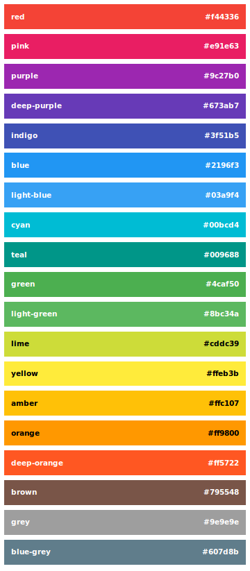

#material-design.css

`material-design.css` bring all material design palette colors to your text, background and border.

##Require
Angular, UI Bootstrap, Bootstrap (CSS), Font-Awesome

##Usage
To use material-design.css in your website, simply drop the stylesheet into your document's `<head>`, and use next template. That's it!

```html
<head>
 <link rel="stylesheet" href="material-design.min.css">
</head>
<body data-ng-app="materialDesign" data-ng-controller="PageCtrl" data-ng-class="{ 'menu-open': menuOpen||menuOpenRight, 'right': menuOpenRight }">
	<header class="navbar navbar-fixed-top bg-indigo" data-ng-class="[ menuOpen||menuOpenRight ? 'darken-2' : '' ]" ...></header>
	<nav class="menu" data-ng-class="{ 'open': menuOpen }" ...></nav>
	<nav class="menu menu-right" data-ng-class="{ 'open': menuOpenRight }" ...></nav>
    <div id="navbar-back" class="navbar-back" data-ng-class="{ 'menu-open': menuOpen||menuOpenRight }"></div>
    <section class="content">
        <section class="content-heading bg-indigo">
            <h1>material-design.css</h1>
        </section>
        <section class="container" role="content">
			Content
		</section>
	</section>
    <footer></footer>
</body>
```

```javascript
angular.module('materialDesign', ['ngAnimate', 'ngCookies', 'ngTouch', 'ngSanitize', 'ngResource', 'ngRoute', 'ui.bootstrap'])
    .controller('PageCtrl', ['$scope', '$window', '$location', '$anchorScroll', function ($scope, $window, $location, $anchorScroll) {

        // Collapsing the menu after navigation
        $scope.$on('$stateChangeSuccess', function () {
            $scope.menuOpen = false;
            $scope.menuOpenRight = false;
            $scope.dropdownFbtnOpen = false;
        });

        // observe scroll of window
        angular.element($window).bind('scroll', function () {
            var scrollTop = $window.scrollY || $window.pageYOffset || $window.document.documentElement.scrollTop;
            var body = angular.element(document.body);
            if (scrollTop > 100) {
                body.addClass('page-offset');
            } else {
                body.removeClass('page-offset');
            }
            if (scrollTop > 0) {
                body.addClass('page-scroll');
            } else {
                body.removeClass('page-scroll');
            }
        });

        $scope.scrollTop = function () {
            $location.hash();
            $anchorScroll();
        };

        /** Menu Design **/
        $scope.menuOpen = false;
        $scope.menuOpenRight = false;
		$scope.dropdownFbtnOpen = false;
		$scope.toggleFbtn = function () {
		    $scope.dropdownFbtnOpen = !$scope.dropdownFbtnOpen;
		};
        angular.element(document.getElementById('navbar-back')).on('mousedown', function () {
            $scope.menuOpen = false;
            $scope.menuOpenRight = false;
            $scope.dropdownFbtnOpen = false;
            $scope.$apply();
        });
        $scope.toggleMenu = function () {
            $scope.menuOpen = !$scope.menuOpen;
            $scope.menuOpenRight = false;
        };
        $scope.toggleProfile = function () {
            $scope.menuOpen = false;
            $scope.menuOpenRight = !$scope.menuOpenRight;
        };
    }]
);
```

##Bower

Add dependency in your bower.json : 

```
"material-design.css": "~1.0.0"
```

Or do `bower install material-design.css --save`.

## Palette of colors

Combine with [material-colors.css](https://github.com/YoannB/material-colors.css) to use the palette of Material Design Colors :



## Custom Builds
material-design.css is powered by [Grunt](http://gruntjs.com), and you can create custom builds pretty easily. First of all, you’ll need Grunt and all other dependencies:

```sh
$ cd path/to/material-design.css/
$ sudo npm install
```

Next, run `grunt watch` to watch for changes and compile your custom builds.

## License
material-colors.css is licensed under the MIT license. (http://opensource.org/licenses/MIT)
